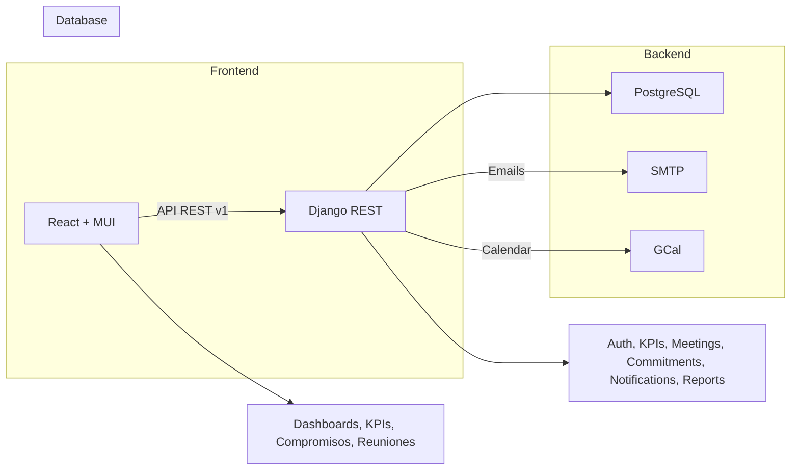

# Plataforma de Gestión de Diálogos de Desempeño (DdD) — Nutrisco

La Plataforma de Gestión de Diálogos de Desempeño (DdD) de Nutrisco es una solución digital diseñada para optimizar y agilizar la toma de decisiones en organizaciones mediante la gestión centralizada de indicadores clave de desempeño (KPIs) y la generación sistemática de compromisos de acción.

## Objetivo

El objetivo principal de la plataforma es facilitar la gestión por excepción, priorizando aquellos KPIs que se encuentran fuera de rango o requieren atención inmediata, permitiendo así una reacción rápida a través de la asignación, seguimiento y cierre de acciones correctivas. La herramienta centraliza la detección, notificación y monitoreo de compromisos, integrando funcionalidades de reporte y alertas automáticas.

## Arquitectura y Tecnologías

La plataforma está construida sobre una arquitectura modular y escalable, compuesta por capas especializadas:

| Capa            | Tecnologías Principales                     | Funcionalidad                                        |
|-----------------|---------------------------------------------|------------------------------------------------------|
| Frontend        | React 18, TypeScript, Vite, MUI             | Interfaz de usuario, visualización de KPIs y gestión de flujos |
| Backend         | Django 5, Python 3.11, Django REST Framework | Lógica de negocio, APIs RESTful, seguridad           |
| Base de Datos   | PostgreSQL 15                               | Persistencia de datos, histórico y auditoría          |
| Servicios       | JWT, Docker, Nginx, Celery                  | Autenticación, contenerización y tareas asíncronas    |

## Diagrama Conceptual



## Estructura del Repositorio

El proyecto está organizado para asegurar la separación de responsabilidades y facilitar la escalabilidad:

```
nutrisco-ddd/
├── frontend/       # Código fuente del cliente (React)
│   └── src/
├── backend/        # Lógica de negocio (Django)
│   ├── apps/
│   └── ddd/
├── docker/         # Configuración de contenerización
├── docs/           # Documentación técnica y funcional
├── scripts/        # Utilidades y scripts auxiliares
```

## Funcionalidades Principales

- Centralización y visualización de KPIs por área y usuario.
- Notificación automática de indicadores fuera de norma.
- Generación, asignación y seguimiento de compromisos.
- Herramientas de reporte, auditoría y exportación de datos.
- Integración con servicios de correo y calendarios.
- Seguridad basada en roles y autenticación JWT.

## Contacto

Para consultas, contribuciones o soporte, por favor contactar a los administradores del repositorio o abrir un issue en [GitHub](https://github.com/ColDev-Colivoro/Proyecto-Estandarizaci-n-normalizacion-Nutrisco).

## Licencia

Este proyecto puede estar sujeto a una licencia específica. Consulte el archivo LICENSE Coldev o contacte a los responsables para más información.
