# Plataforma de Gestión de Diálogos de Desempeño (DdD) — Nutrisco

La Plataforma de Gestión de Diálogos de Desempeño (DdD) de Nutrisco es una solución digital diseñada para optimizar y agilizar la toma de decisiones en organizaciones mediante la gestión de indicadores clave de desempeño (KPIs) **agrupados por áreas específicas**. Facilita la generación sistemática de compromisos de acción dentro del contexto de **Diálogos de Desempeño (DdD) especializados (Estratégicos, Tácticos y Operativos)**.

## Objetivo

El objetivo principal de la plataforma es facilitar la gestión por excepción, priorizando aquellos KPIs **de un área específica** que se encuentran fuera de rango o requieren atención inmediata. Esto permite una reacción rápida a través de la asignación, seguimiento y cierre de acciones correctivas generadas en los **DdD correspondientes**. La herramienta centraliza la detección, notificación y monitoreo de compromisos, integrando funcionalidades de reporte y alertas automáticas.

## Arquitectura y Tecnologías

La plataforma está construida sobre una arquitectura modular y escalable, compuesta por capas especializadas:

| Capa            | Tecnologías Principales                     | Funcionalidad                                        |
|-----------------|---------------------------------------------|------------------------------------------------------|
| Frontend        | React 18, TypeScript, Vite, MUI             | Interfaz de usuario, visualización de KPIs y gestión de flujos |
| Backend         | Django 5, Python 3.11, Django REST Framework | Lógica de negocio, APIs RESTful, seguridad           |
| Base de Datos   | PostgreSQL 15                               | Persistencia de datos, histórico y auditoría          |
| Servicios       | JWT, Docker, Nginx, Celery                  | Autenticación, contenerización y tareas asíncronas    |

## Diagrama Conceptual

```mermaid
flowchart LR
  %% --- FLUJO GENERAL ---
  subgraph FLUJO_GENERAL["📊 FLUJO GENERAL"]
    direction TB
    Informe[/"📄 Informe por Área\n(WR, PHP, Fisherman, Conservas)"/]
    Datos["🗂️ Datos del Informe\n(Producción, Calidad, etc.)"]
    KPIsArea["📋 KPIs por Área\n(Específicos de cada área)"]
    Informe --> Datos --> KPIsArea
  end

  %% --- SISTEMA PRINCIPAL: DdD ESTRATÉGICO / TÁCTICO / OPERATIVO ---
  subgraph SISTEMA["⚙️ SISTEMA DE DdD"]
    direction TB

    subgraph ESTRAT["🎯 DdD ESTRATÉGICO"]
      direction TB
      Gerencia["👩‍💼 Gerencia General\n(Todas las áreas)"]
      KPIsEstrat["📈 KPIs Estratégicos\n(Todas las áreas)"]
      ReuEstrat["🗓️ DdD Estratégico\n9:00-9:30 (30 min)"]
      Gerencia --> ReuEstrat
      KPIsEstrat --> ReuEstrat
    end

    subgraph TACTIC["⚡ DdD TÁCTICO"]
      direction TB
      JefesPlanta["🧑‍🏭 Jefes de Planta + Equipo\n(Por área específica)"]
      KPIsTact["📊 KPIs Tácticos\n(Por departamento/área)"]
      ReuTact["🗓️ DdD Táctico\n8:45-9:00 (15 min)"]
      JefesPlanta --> ReuTact
      KPIsTact --> ReuTact
    end

    subgraph OPER["🔧 DdD OPERATIVO"]
      direction TB
      Operadores["👷 Operadores + Supervisores\n(Por turno y área)"]
      KPIsOper["📉 KPIs Operativos\n(Por turno/línea)"]
      ReuOper["🗓️ DdD Operativo\n8:00-8:30 (30 min)"]
      Operadores --> ReuOper
      KPIsOper --> ReuOper
    end

    %% conexiones internas
    KPIsArea --> KPIsEstrat
    KPIsArea --> KPIsTact
    KPIsArea --> KPIsOper
  end

  %% --- USUARIOS Y PERMISOS (arriba a la derecha en el original) ---
  subgraph USERS["👥 USUARIOS Y PERMISOS"]
    direction TB
    Admin["🔑 Administrador\n(Crea KPIs todas áreas)"]
    JefeArea["🧾 Jefe de Área\n(Agrega datos de su área)"]
    Oper["👤 Operador\n(Participa en DdD operativo)"]
  end

  %% --- SISTEMA DE ALERTAS ---
  subgraph ALERTS["🚨 SISTEMA DE ALERTAS"]
    direction TB
    KPI_Fuera["⚠️ KPI Fuera de Norma\n(Detecta desviaciones)"]
    AlertaDdD["📣 Alerta en DdD\n(Según reunión activa)"]
    KPI_Fuera --> AlertaDdD
  end

  %% Conectar sistema principal con usuarios y alertas (relaciones)
  Admin --> KPIsEstrat
  Admin --> KPIsTact
  Admin --> KPIsOper
  JefeArea --> KPIsTact
  Oper --> KPIsOper

  %% Llamada central a alertas desde reuniones
  ReuEstrat --> KPI_Fuera
  ReuTact --> KPI_Fuera
  ReuOper --> KPI_Fuera

  %% --- GESTIÓN DE COMPROMISOS (debajo) ---
  subgraph GESTION["✅ GESTIÓN DE"]
    direction TB
    CrearComp["📝 Crear Compromiso\n(Desde alerta)"]
    AsignResp["👤 Asignar Responsable\n(Usuario del área)"]
    Seguimiento["🔁 Seguimiento\n(Estados y fechas)"]
    CrearComp --> AsignResp --> Seguimiento
  end

  %% --- Conexiones finales ---
  AlertaDdD --> CrearComp

  %% Estilos para los nodos "claros"
  style Informe fill:#616161,color:#ffffff
  style KPIsArea fill:#616161,color:#ffffff
  style ReuEstrat fill:#616161,color:#ffffff
  style ReuTact fill:#616161,color:#ffffff
  style ReuOper fill:#616161,color:#ffffff
  style KPI_Fuera fill:#616161,color:#ffffff
  style CrearComp fill:#616161,color:#ffffff

  %% Estilos para los subgraphs (mantener el estilo oscuro general)
  classDef box fill:#2f2f2f,stroke:#555,color:#fff;
  class SISTEMA,FLUJO_GENERAL,USERS,ALERTS,GESTION box;
```



## Estructura del Repositorio

El proyecto está organizado para asegurar la separación de responsabilidades y facilitar la escalabilidad:

```
nutrisco-ddd/
├── frontend/       # Código fuente del cliente (React)
│   └── src/
├── backend/        # Lógica de negocio (Django)
│   ├── apps/
│   └── ddd/
├── docker/         # Configuración de contenerización
├── docs/           # Documentación técnica y funcional
├── scripts/        # Utilidades y scripts auxiliares
```

## Funcionalidades Principales

- Centralización y visualización de **KPIs específicos por área y usuario**.
- **Detección de desviaciones y notificación automática** de indicadores fuera de norma **en el contexto del DdD correspondiente**.
- **Gestión de Diálogos de Desempeño (DdD) Estratégicos, Tácticos y Operativos**, adaptados a diferentes niveles organizacionales y áreas.
- Generación, asignación y seguimiento de compromisos.
- Herramientas de reporte, auditoría y exportación de datos.
- Integración con servicios de correo y calendarios.
- Seguridad basada en roles y autenticación JWT.

## Contacto

Para consultas, contribuciones o soporte, por favor contactar a los administradores del repositorio o abrir un issue en [GitHub](https://github.com/ColDev-Colivoro/Proyecto-Estandarizaci-n-normalizacion-Nutrisco).

## Licencia

Este proyecto puede estar sujeto a una licencia específica. Consulte el archivo LICENSE Coldev o contacte a los responsables para más información.
