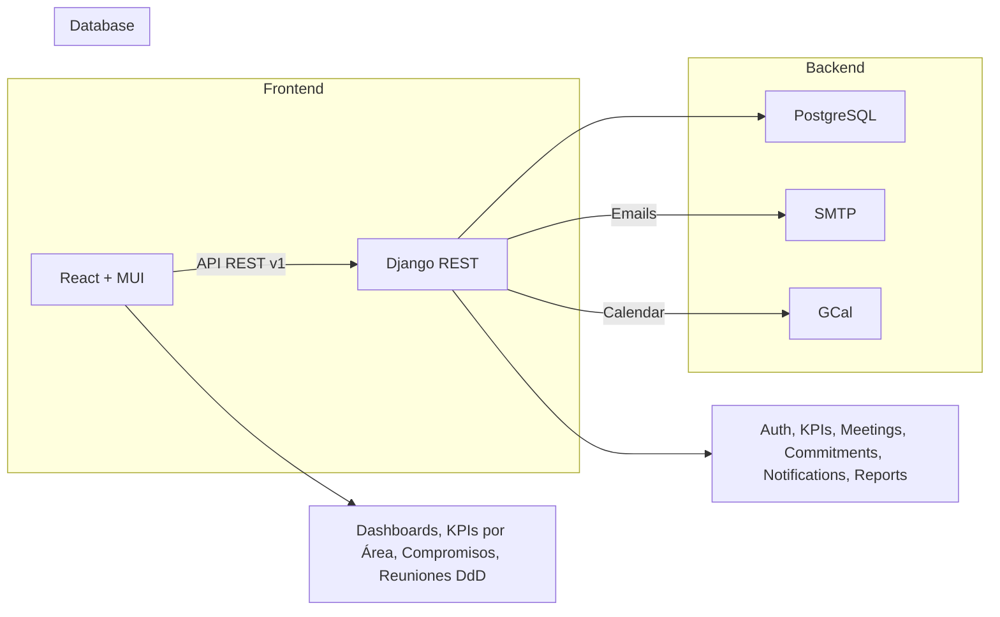
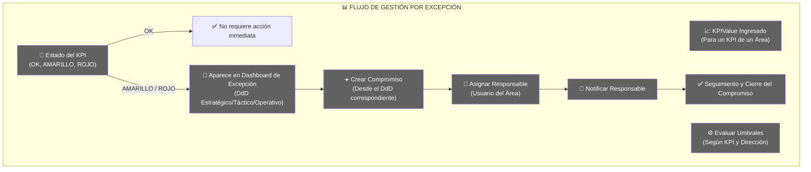
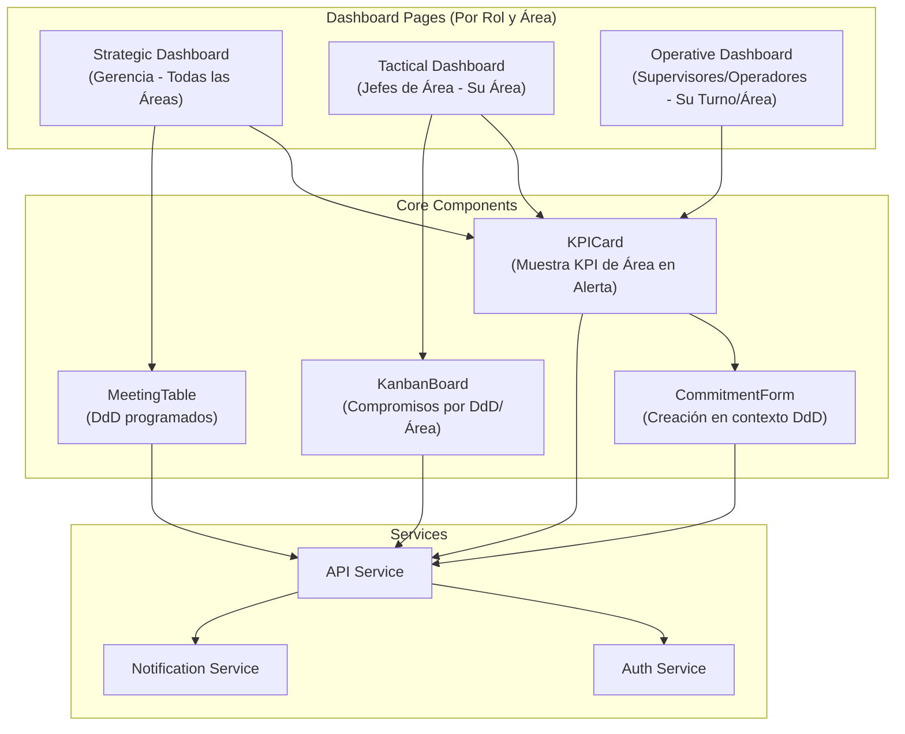
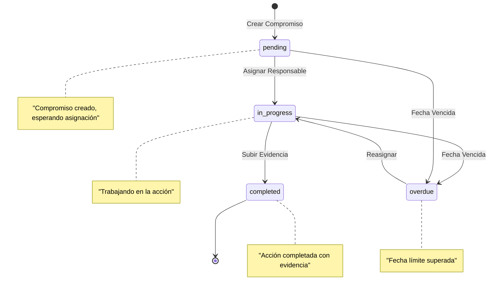
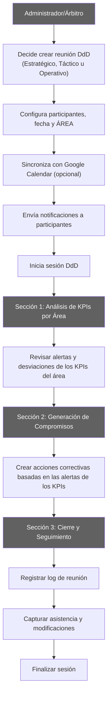
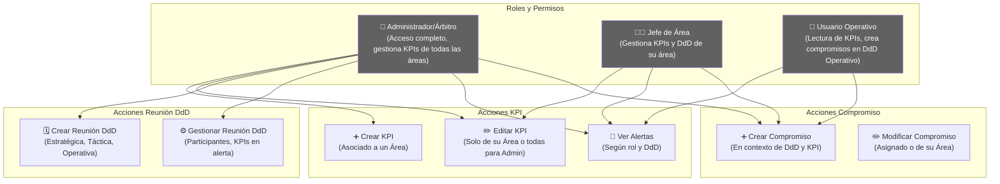

# Plataforma de Gestión de Diálogos de Desempeño (DdD) - Nutrisco

Este documento maestro unificado consolida la estructura, el alcance y las especificaciones técnicas para la Plataforma de Gestión de Diálogos de Desempeño (DdD) de Nutrisco. Está diseñado como el *single source of truth* para el Product Owner, la gerencia y el equipo de desarrollo, cubriendo desde la visión de negocio hasta los contratos de la API y el plan de despliegue.

## 1. Visión General y Resumen Ejecutivo

La Plataforma DdD de Nutrisco es una herramienta digital de gestión por excepción, enfocada en digitalizar y agilizar la toma de decisiones. Su objetivo principal es exponer y priorizar los KPIs **específicos de cada área** que están fuera de norma (alerta) para facilitar la acción inmediata a través de la generación de Compromisos (acciones) **dentro del contexto de los Diálogos de Desempeño (DdD) correspondientes (Estratégicos, Tácticos u Operativos)**.

### Exportar a Hojas de cálculo

## 2. Imagen Conceptual y Arquitectura de Alto Nivel

La plataforma utiliza una arquitectura moderna y modular para garantizar escalabilidad, seguridad y una experiencia de usuario fluida.

### 2.1. Arquitectura & Stack Técnico

| Capa | Tecnología Principal | Propósito |
|------|---------------------|-----------|
| Frontend (FE) | React 18 + TypeScript (Vite) + MUI | Interfaz de usuario, flujos de **KPIs por área**, Dashboards. Migración planificada a TypeScript. |
| Backend (BE) | Django 5 + Python 3.11 + DRF | Lógica de negocio, APIs RESTful, seguridad (RBAC). |
| Base de Datos (DB) | PostgreSQL 15 | Persistencia de datos, histórico de KPIs y auditoría. |
| Servicios | JWT, Docker, Nginx, Celery | Autenticación segura, Contenerización, Despliegue, Tareas asíncronas (Importación, Notificaciones). |

### Exportar a Hojas de cálculo

### 2.2. Diagrama Conceptual (Mermaid Flowchart)



**Explicación del Diagrama Conceptual:**
Este diagrama ilustra la arquitectura general del sistema, donde los KPIs están organizados por áreas y los Diálogos de Desempeño (DdD) se adaptan a diferentes niveles (Estratégico, Táctico, Operativo) para gestionar las alertas y generar compromisos.

### 2.3. Estructura de Repositorio (Key Folders)

El repositorio principal nutrisco-ddd/ se organizará con una clara separación de responsabilidades:

```
orizont-ddd/
├── frontend/
│   ├── src/ (components, pages, services, hooks, types)
├── backend/
│   ├── apps/ (users, kpis, meetings, commitments, notifications, reports)
│   ├── ddd/ (settings, config)
├── docker/
├── docs/
└── scripts/
```

## 3. Modelo de Datos Esenciales (Core Models)

Definición de los modelos Django ORM que sustentan el sistema.

| Modelo | Descripción y Campos Clave | Consideraciones |
|--------|---------------------------|-----------------|
| Modelo | Descripción y Campos Clave | Consideraciones |
|--------|---------------------------|-----------------|
| Area | Entidad de negocio. `name`, `manager` (FK a CustomUser), `is_active`. | Permite segmentar **KPIs, Reuniones DdD y Compromisos por área**. |
| CustomUser | Extensión de AbstractUser. `area` (FK), `role` (Estratégico, Táctico, Operativo). | Define permisos y acceso a Dashboards **según el área y rol**. |
| KPI | Métrica de desempeño. `name`, `area` (FK), `meta`, `umbral_amarillo`, `umbral_rojo`, `direction` (CRÍTICO: higher_is_better \| lower_is_better). | **Cada KPI está asociado a un área específica.** |
| KPIValue | Registro histórico del valor. `kpi` (FK), `date`, `value`, `shift`, `source`. | Permite auditoría y cálculo de tendencias **para KPIs de un área**. |
| MeetingType | Plantilla de reunión. `name` (DdD Estratégico/Táctico/Operativo), `schedule_time`, `frequency`. | Configura la automatización de reuniones **DdD por tipo y área**. |
| Meeting | Instancia de una reunión DdD. `meeting_type` (FK), `date`, `participants` (M2M), `area` (FK), `status`, `notes`, `google_calendar_event_id`. | Unidad de tiempo y contexto para los Compromisos, **siempre vinculada a un área y tipo de DdD**. |
| Commitment | Acción derivada. `meeting` (FK), `kpi` (FK, opc.), `description`, `proposed_action`, `responsible` (FK), `due_date`, `status` (pending, in_progress, completed, overdue), `attachments`. | Captura la acción y permite trazabilidad **dentro del contexto de un DdD y un KPI específico de un área**. |
| KPIAlert (Sugerido) | Modelo auxiliar. `kpi` (FK), `date`, `level` (AMARILLO \| ROJO), `is_active`. | **Alerta generada para un KPI específico de un área.** |

### Exportar a Hojas de cálculo

## 4. Funcionalidades Core y Reglas de Negocio

### 4.1. Gestión por Excepción (Motor de KPIs)

El motor evalúa `KPIValue` contra `KPI` **de un área específica** para determinar el estado: OK (Verde), AMARILLO, ROJO.

**Lógica de Umbrales:** Depende del campo direction en el modelo KPI.

- Ejemplo higher_is_better: value < umbral_rojo → ROJO.
- Ejemplo lower_is_better: value > umbral_rojo → ROJO.

**Alertas:** Las desviaciones (AMARILLO/ROJO) disparan:

1. Listado prioritario en el Dashboard de Gestión por Excepción.
2. Notificaciones por email/push al responsable del área.
3. Pre-carga de la información de la desviación en el formulario de Creación Rápida de Compromiso.

### 4.2. Sistema DdD (Flujo Central)

#### Creación de Reuniones
- **Creación Manual:** El administrador o árbitro del diálogo de desempeño puede crear reuniones DdD cuando lo estime conveniente.
- **Creación Automática:** Opcionalmente, las reuniones pueden programarse automáticamente (cron basado en MeetingType).
- **Integración:** Opción de sincronizar con Google Calendar (google_calendar_event_id) para notificar a los participantes.

#### Estructura de Sesión DdD
Cada sesión de DdD se divide en **3 secciones por tiempo**:

1. **Sección 1 - Análisis de KPIs por Área:** Revisión de alertas y desviaciones del período **para los KPIs relevantes al DdD**.
2. **Sección 2 - Generación de Compromisos:** Creación de acciones correctivas basadas en las alertas **de los KPIs presentados en el DdD**.
3. **Sección 3 - Cierre y Seguimiento:** Registro de log de la reunión, modificaciones y lista de personas presentes

#### Interfaz de Reunión
- **Snapshot de KPIs por Área:** Presenta los KPIs **del área correspondiente** que están en alerta al momento de la reunión.
- **Creación Expedita:** Permite generar compromisos directamente desde las alertas **de los KPIs mostrados**.
- **Registro de Actas:** Captura notas, modificaciones y asistencia de participantes

### 4.3. Flujo de Compromisos (Lifecycle)

- **Creación Rápida:** Al crear un Compromiso desde un KPI en alerta **en el contexto de un DdD**, el sistema pre-carga `kpi`, `area`, y `description` (con plantilla).
- **Notificación:** Notificación inmediata (email + in-app) al `responsible` asignado **para el compromiso generado en el DdD**.
- **Vencimiento (Overdue):** El estado cambia automáticamente a overdue si due_date pasa y el estado no es completed.
- **Auditoría de Cierre:** El cambio de estado a completed requiere una evidencia (adjunto) y un comentario de cierre obligatorio.

### 4.4. Autenticación y Autorización (Seguridad)

#### Gestión de Autenticación
- **Base de Datos Actual:** El sistema se conectará a la base de datos existente de Nutrisco para obtener usuarios y roles.
- **Auth:** JWT (Access + Refresh Token). Preparado para futura integración OAuth2/SSO.
- **Integración de Roles:** Los roles se obtienen desde la base de datos actual y se mapean al sistema DdD.

#### Control de Acceso y Permisos
**RBAC (Role-Based Access Control):**

- **Administrador/Árbitro:** Acceso completo al sistema, puede crear reuniones DdD y gestionar **KPIs de todas las áreas**.
- **Jefes de Área:** Pueden modificar únicamente los KPIs de su área asignada y participar en los DdD Tácticos.
- **Usuarios Operativos:** Solo lectura de KPIs y creación de compromisos **en el contexto de los DdD Operativos**.

**Reglas Específicas de KPIs:**
- ✅ **Modificación:** Solo jefes de área (de su área) y administrador/árbitro pueden modificar **los KPIs de sus respectivas áreas**.
- ✅ **Visualización de Alertas:** Todos los usuarios pueden ver alertas de los KPIs **relevantes a su rol y área en los Dashboards correspondientes**.
- ✅ **Creación de Compromisos:** Todos pueden crear compromisos desde cualquier alerta visible **en el contexto de un DdD**.

#### Auditoría
Todas las acciones críticas (CRUD de KPI **por área**, cambios de estado de Compromiso) deben registrarse en logs de auditoría.

## 5. Interfaces y Dashboards

Los Dashboards se diseñan bajo el principio de Gestión por Excepción, priorizando la acción sobre la simple visualización.

| Dashboard | Rol / Audiencia | Foco Principal |
|-----------|-----------------|----------------|
| Dashboard | Rol / Audiencia | Foco Principal |
|-----------|-----------------|----------------|
| Strategic Dashboard | Gerencia, Estratégico | Vista consolidada de Riesgo (**KPIs estratégicos de todas las áreas**) y resumen de Compromisos pendientes/vencidos. |
| Tactical Dashboard | Jefes de Área, Táctico | Tablero de Compromisos de su área (Kanban simple por estado) y **KPIs tácticos desviados de su área**. |
| Operative Dashboard | Supervisores, Operativo | **Métricas operativas por Turno/Línea** y creación expedita de Compromisos Operativos. |

### Exportar a Hojas de cálculo

### Componente Clave: KPICard

El componente KPICard es el motor visual de la excepción. Muestra el KPI **específico de un área**, su último valor y color de estado (🔴/🟡/🟢). Incluye la llamada a la acción (CTA) principal: Crear Compromiso (que abre el CommitmentForm precargado **en el contexto del DdD**).

## 6. Integración, Pruebas y Despliegue (Parte 2 en Detalle)

Esta sección consolida los planes de trabajo para la implementación y la calidad.

### 6.1. Integración con Excel

- **Importación:** Se debe soportar la carga masiva de `KPIValue` y la creación/actualización de `KPI` **por área** a través de plantillas Excel/CSV estandarizadas.
- **Procesamiento Asíncrono:** La importación se procesa en background (Celery) debido a que puede ser una tarea de larga duración.
- **Reporting de Errores:** Tras la importación, el usuario recibe un import_log detallando filas procesadas, creadas, actualizadas y las que fallaron (con el motivo, ej. "Área inexistente" o "Valor no numérico").

### 6.2. Estrategia de Pruebas (QA)

- **Unit Tests:** Cobertura de la lógica de negocio más sensible (cálculo de umbrales de KPIs **por área**, upsert de KPIValues, flujo de notificaciones).
- **E2E (End-to-End):** Uso de Cypress/Playwright para validar los flujos críticos: Login → Dashboard **(por rol/área)** → Crear Compromiso **(en DdD)** → Subir Evidencia → Cerrar Compromiso.
- **Entorno:** Un entorno de staging reproducible (Docker) es obligatorio para la validación de QA antes del deploy a producción.

### 6.3. Despliegue y CI/CD (DevOps)

- **Pipeline:** Implementación de CI/CD (ej. GitHub Actions) que automatice: Tests → Build → Deploy Staging → E2E Smoke → Deploy Producción (Aprobación Manual).
- **Infraestructura:** Contenedores de Docker para BE, FE, Worker (Celery), y DB (Postgres).
- **Observability:** Logs centralizados, métricas básicas (latencia, error rate) y gestión segura de secretos de producción.

### 6.4. Cronograma (Sprint Compacto)

Se estima un cronograma inicial de 3-4 sprints (5 días hábiles) para alcanzar un MVP desplegable en producción:

- **Sprint 0 (Setup):** Repositorio, Docker, CI básico, Modelos Core (User, Area).
- **Sprint 1 (Base):** Autenticación JWT, CRUD de KPI **por área**, Inserción de KPIValue, Dashboard inicial (solo KPIs **desviados por área**).
- **Sprint 2 (Core DdD):** Modelos Meeting y Commitment, Flujo Crear Compromiso desde KPI **en DdD**, Notificaciones básicas, Admin KPI Table.
- **Sprint 3 (QA & Go-Live):** Importación Excel **de KPIs por área**, E2E Tests, Despliegue Staging y Producción, refinamiento de Dashboards.

## 7. Diagramas Adicionales para Visualización

### 7.1. Flujo de Gestión por Excepción



### 7.2. Arquitectura de Componentes Frontend



### 7.3. Estados del Compromiso



### 7.4. Flujo de Creación de Reunión DdD y Estructura de Sesión



> **Explicación del diagrama:** Este flujo muestra cómo el administrador o árbitro puede crear reuniones DdD de manera manual cuando lo estime conveniente. Cada sesión se estructura en 3 secciones temporales: análisis, generación de compromisos y cierre con registro completo de la reunión.

### 7.5. Matriz de Permisos por Rol



> **Explicación del diagrama:** Esta matriz detalla los permisos específicos por rol. Los KPIs están fuertemente vinculados a las áreas. Los administradores pueden crear y modificar KPIs de todas las áreas, mientras que los jefes de área solo pueden gestionar los KPIs de su área. Todos los usuarios pueden ver las alertas de KPIs relevantes a su contexto de DdD, y pueden crear compromisos dentro de esas reuniones.
