# Plataforma de Gestión de Diálogos de Desempeño (DdD) - Nutrisco

Este documento maestro unificado consolida la estructura, el alcance y las especificaciones técnicas para la Plataforma de Gestión de Diálogos de Desempeño (DdD) de Nutrisco. Está diseñado como el *single source of truth* para el Product Owner, la gerencia y el equipo de desarrollo, cubriendo desde la visión de negocio hasta los contratos de la API y el plan de despliegue.

## 1. Visión General y Resumen Ejecutivo

La Plataforma DdD de Nutrisco es una herramienta digital de gestión por excepción, enfocada en digitalizar y agilizar la toma de decisiones. Su objetivo principal es exponer y priorizar los KPIs **específicos de cada área** que están fuera de norma (alerta) para facilitar la acción inmediata a través de la generación de Compromisos (acciones) **dentro del contexto de los Diálogos de Desempeño (DdD) correspondientes (Estratégicos, Tácticos u Operativos)**.

### Exportar a Hojas de cálculo

## 2. Imagen Conceptual y Arquitectura de Alto Nivel

La plataforma utiliza una arquitectura moderna y modular para garantizar escalabilidad, seguridad y una experiencia de usuario fluida.

### 2.1. Arquitectura & Stack Técnico

| Capa | Tecnología Principal | Propósito |
|------|---------------------|-----------|
| Frontend (FE) | React 18 + TypeScript (Vite) + MUI | Interfaz de usuario, flujos de **KPIs por área**, Dashboards. Migración planificada a TypeScript. |
| Backend (BE) | Django 5 + Python 3.11 + DRF | Lógica de negocio, APIs RESTful, seguridad (RBAC). |
| Base de Datos (DB) | PostgreSQL 15 | Persistencia de datos, histórico de KPIs y auditoría. |
| Servicios | JWT, Docker, Nginx, Celery | Autenticación segura, Contenerización, Despliegue, Tareas asíncronas (Importación, Notificaciones). |

### Exportar a Hojas de cálculo

### 2.2. Diagrama Conceptual (Mermaid Flowchart)

```mermaid
flowchart TD
  %% --- ARQUITECTURA TÉCNICA ---
  subgraph TECH["🏗️ ARQUITECTURA TÉCNICA"]
    subgraph FRONTEND["💻 Frontend"]
      FE["React + MUI"]
      PLANNER["📅 Admin Planner<br/>(Calendarizador DdD)"]
      UI["🎨 UI/UX<br/>(Dashboards, Forms)"]
    end
    
    subgraph BACKEND["⚙️ Backend"]
      BE["Django REST"]
      API["🔌 APIs RESTful"]
      AUTH["🔐 JWT Auth"]
      SERVICES["📋 Services<br/>(KPIs, Meetings, Commitments)"]
    end
    
    subgraph DATABASE["🗄️ Base de Datos"]
      DB["PostgreSQL 15"]
      TABLES["📊 Tablas<br/>(Users, KPIs, Meetings, Commitments)"]
    end
    
    subgraph EXTERNAL["🌐 Servicios Externos"]
      GCAL["📆 Google Calendar"]
      SMTP["📧 SMTP Email"]
    end
    
    %% Conexiones técnicas
    FE --> API
    PLANNER --> API
    UI --> FE
    BE --> DB
    BE --> GCAL
    BE --> SMTP
    API --> BE
    AUTH --> BE
    SERVICES --> BE
    TABLES --> DB
  end

  %% --- FLUJO CONCEPTUAL ---
  subgraph CONCEPTUAL["📊 FLUJO CONCEPTUAL"]
    %% Administrador
    subgraph ADMIN["🔧 ADMINISTRADOR"]
      Admin["🔑 Administrador"]
      Admin --> PLANNER
    end
    
    %% Flujo General
    subgraph FLUJO_GENERAL["📈 FLUJO GENERAL"]
      Informe[/"📄 Informe por Área\n(WR, PHP, Fisherman, Conservas)"/]
      Datos["🗂️ Datos del Informe\n(Producción, Calidad, etc.)"]
      KPIsArea["📋 KPIs por Área\n(Específicos de cada área)"]
      Informe --> Datos --> KPIsArea
    end
    
    %% Dialog Management Hub
    subgraph DIALOG_HUB["🏛️ DIALOG MANAGEMENT HUB"]
      DialogHub["🎯 Dialog Management Hub<br/>(Espacio Central de Reuniones)"]
      Area1["🏭 Área 1"]
      Area2["🏭 Área 2"]  
      AreaN["🏭 Área N"]
      DialogHub --> Area1
      DialogHub --> Area2
      DialogHub --> AreaN
    end
    
    %% Sistema DdD
    subgraph SISTEMA["⚙️ SISTEMA DE DdD"]
      subgraph ESTRAT["🎯 DdD ESTRATÉGICO"]
        Gerencia["👩‍💼 Gerencia General<br/>(Todas las áreas)"]
        KPIsEstrat["📈 KPIs Estratégicos\n(Todas las áreas)"]
        ReuEstrat["🗓️ DdD Estratégico<br/>9:00-9:30 (30 min)"]
        TemasEstrat["📝 Temas Abordados"]
        CompEstrat["✅ Compromisos Generados"]
        Gerencia --> ReuEstrat
        KPIsEstrat --> ReuEstrat
        ReuEstrat --> TemasEstrat
        ReuEstrat --> CompEstrat
      end
      
      subgraph TACTIC["⚡ DdD TÁCTICO"]
        JefesPlanta["🧑‍🏭 Jefes de Planta + Equipo\n(Por área específica)"]
        KPIsTact["📊 KPIs Tácticos\n(Por departamento/área)"]
        ReuTact["🗓️ DdD Táctico<br/>8:45-9:00 (15 min)"]
        TemasTact["📝 Temas Abordados"]
        CompTact["✅ Compromisos Generados"]
        JefesPlanta --> ReuTact
        KPIsTact --> ReuTact
        ReuTact --> TemasTact
        ReuTact --> CompTact
      end
      
      subgraph OPER["🔧 DdD OPERATIVO"]
        Operadores["👷 Operadores + Supervisores<br/>(Por turno y área)"]
        KPIsOper["📉 KPIs Operativos\n(Por turno/línea)"]
        ReuOper["🗓️ DdD Operativo<br/>8:00-8:30 (30 min)"]
        TemasOper["📝 Temas Abordados"]
        CompOper["✅ Compromisos Generados"]
        Operadores --> ReuOper
        KPIsOper --> ReuOper
        ReuOper --> TemasOper
        ReuOper --> CompOper
      end
      
      %% Conexiones internas DdD
      KPIsArea --> KPIsEstrat
      KPIsArea --> KPIsTact
      KPIsArea --> KPIsOper
    end
    
    %% Usuarios y Alertas
    subgraph USERS["👥 USUARIOS Y PERMISOS"]
      JefeArea["🧾 Jefe de Área<br/>(Agrega datos de su área)"]
      Oper["👤 Operador\n(Participa en DdD operativo)"]
    end
    
    subgraph ALERTS["🚨 SISTEMA DE ALERTAS"]
      KPI_Fuera["⚠️ KPI Fuera de Norma\n(Detecta desviaciones)"]
      AlertaDdD["📣 Alerta en DdD\n(Según reunión activa)"]
      KPI_Fuera --> AlertaDdD
    end
    
    %% Gestión de Compromisos
    subgraph GESTION["✅ GESTIÓN DE COMPROMISOS"]
      CrearComp["📝 Crear Compromiso<br/>(Desde alerta)"]
      AsignResp["👤 Asignar Responsable<br/>(Usuario del área)"]
      Seguimiento["🔁 Seguimiento<br/>(Estados y fechas)"]
      CrearComp --> AsignResp --> Seguimiento
    end
    
    %% Conexiones conceptuales
    PLANNER --> DialogHub
    DialogHub --> ReuEstrat
    DialogHub --> ReuTact
    DialogHub --> ReuOper
    
    JefeArea --> KPIsTact
    Oper --> KPIsOper
    
    ReuEstrat --> KPI_Fuera
    ReuTact --> KPI_Fuera
    ReuOper --> KPI_Fuera
    
    AlertaDdD --> CrearComp
    CompEstrat --> CrearComp
    CompTact --> CrearComp
    CompOper --> CrearComp
  end
  
  %% Conexión entre arquitectura y flujo conceptual
  TECH --> CONCEPTUAL
  
  %% Estilos
  style FE fill:#e3f2fd,color:#000
  style PLANNER fill:#fff3e0,color:#000
  style BE fill:#fff3e0,color:#000
  style DB fill:#ffebee,color:#000
  style DialogHub fill:#e1f5fe,color:#000
  style ReuEstrat fill:#ffebee,color:#000
  style ReuTact fill:#e8f5e8,color:#000
  style ReuOper fill:#f3e5f5,color:#000
  style KPI_Fuera fill:#fff9c4,color:#000
  style CrearComp fill:#f1f8e9,color:#000
  style TemasEstrat fill:#e8f5e8,color:#000
  style CompEstrat fill:#c8e6c9,color:#000
  style TemasTact fill:#e8f5e8,color:#000
  style CompTact fill:#c8e6c9,color:#000
  style TemasOper fill:#e8f5e8,color:#000
  style CompOper fill:#c8e6c9,color:#000
  
  %% Estilos para subgraphs
  classDef techBox fill:#f8f9fa,stroke:#333,color:#000,stroke-width:2px
  classDef conceptBox fill:#2f2f2f,stroke:#555,color:#fff
  
  class FRONTEND,BACKEND,DATABASE,EXTERNAL techBox
  class ADMIN,FLUJO_GENERAL,DIALOG_HUB,SISTEMA,USERS,ALERTS,GESTION conceptBox
```

**Explicación del Diagrama Conceptual Integrado:**
Este diagrama unificado ilustra la arquitectura técnica y el flujo conceptual completo del sistema. Se ha expandido para incluir el **Admin Planner** como un componente clave en el Frontend, permitiendo al administrador calendarizar reuniones DdD y sincronizarlas con **Google Calendar**. El **Dialog Management Hub** representa el espacio central donde se llevan a cabo los diálogos de desempeño, abordando cada área y registrando los temas discutidos y los compromisos generados. Los KPIs están organizados por áreas y los Diálogos de Desempeño (DdD) se adaptan a diferentes niveles (Estratégico, Táctico, Operativo) para gestionar las alertas y generar compromisos.
