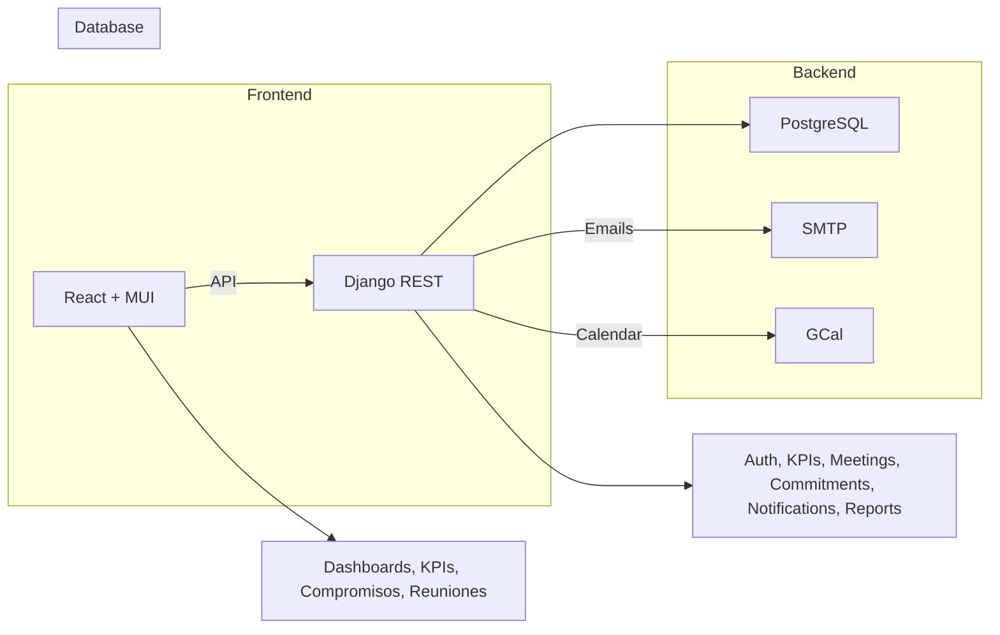
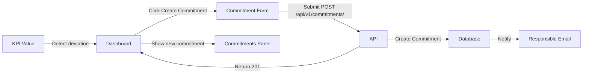

# 🚀 Plataforma de Gestión de Diálogos de Desempeño (DdD) - Nutrisco

**Documento Maestro — Versión destinada al Product Owner y como README inicial del proyecto. Contiene la estructura general, diagrama / imagen conceptual y la primera mitad del documento maestro consolidado. 

## ÍNDICE

1. [Resumen ejecutivo](#1-resumen-ejecutivo)
2. [Imagen conceptual & estructura general (diagrama)](#2-imagen-conceptual--estructura-general)
3. [Prototipo visual y estado de validación](#3-prototipo-visual-y-validación)
4. [Arquitectura técnica (visión general)](#4-arquitectura-técnica-visión-general)
5. [Estructura de carpetas y organización del repositorio](#5-estructura-de-carpetas-y-organización-del-repositorio)
6. [Modelo de datos — Parte I](#6-modelo-de-datos--parte-i)
7. [Sistema de reuniones — Parte I](#7-sistema-de-reuniones--parte-i)
8. [Gestión de compromisos — Parte I](#8-gestión-de-compromisos--parte-i)
9. [Funcionalidades core](#9-funcionalidades-core-detalle-ampliado)
10. [Interfaces y dashboards](#10-interfaces-y-dashboards-detalle-funcional-y-componentes)
11. [Arquitectura frontend](#11-arquitectura-frontend-resumen-técnico)
12. [API Backend](#12-api-backend-django-rest--endpoints-y-ejemplos-rápidos)
13. [Integración Excel](#13-integración-excel-plantillas-y-reglas-de-validación)
14. [Pruebas](#14-pruebas-testing--plan-resumido)
15. [Despliegue, CI/CD y operaciones](#15-despliegue-cicd-y-operaciones-resumen-ejecutable)
16. [Cronograma por sprint](#16-cronograma-por-sprint-compacto-3-semanas-base)
17. [Criterios de aceptación y Definition of Done](#17-criterios-de-aceptación-y-definition-of-done-dod)
18. [Diagramas y flujos](#18-diagramas-y-flujos-mermaid--bloques-listos)


## 1. Resumen ejecutivo

La Plataforma de Gestión de Diálogos de Desempeño (DdD) de Nutrisco es una herramienta centrada en la gestión por excepción: prioriza y expone únicamente los KPIs que están fuera de norma para facilitar la acción inmediata. El núcleo operativo es la reunión llamada Diálogo de Desempeño (DdD) —en la que los jefes de área analizan KPIs en alerta y generan compromisos para su resolución—. El sistema centraliza detección, asignación, seguimiento y cierre de acciones (compromisos), con notificaciones y reportes automáticos.

### Objetivos principales:

- Digitalizar y centralizar el seguimiento de KPIs por área.
- Agilizar la toma de decisiones mediante alertas y creación rápida de compromisos.
- Facilitar la comunicación entre niveles (estratégico, táctico, operativo).
- Generar trazabilidad y evidencia del cumplimiento de acciones.

**Audiencia:** Product Owner, Gerencia, Jefes de Área, Supervisores, Equipo de TI.

## 2. Imagen conceptual & estructura general

A continuación se presenta una representación conceptual de alto nivel de la plataforma. Esta imagen pretende ser la guía visual del sistema para el Product Owner y el equipo técnico.

### Mermaid flowchart (visual placeholder)



> **Nota visual:** cuando se valide esta parte, generaré una imagen SVG/PNG final (diagramas Mermaid convertidos) que podrá incorporarse al README y al kit de presentación.

## 3. Prototipo visual y validación

**Estado actual:** prototipo al 30% (referencia de diseño y flujos). Inicialmente desarrollado en React + Vite con JS para prototipado rápido; migración planificada a TypeScript.

**Propósitos del prototipo:** validar flujos (crear compromiso desde KPI), pruebas de responsividad en tablet/desktop, validar experiencia de usuario en reuniones DdD.

**Próximo hito:** versión prototipo completa (v1 del prototipo) en ~2 días para validación con stakeholders (Fabian Bustos y jefes de área).

## 4. Arquitectura técnica (visión general)

### Stack propuesto:

- **Frontend:** React 18 + TypeScript (Vite)
- **Backend:** Django 5 + Python 3.11 + Django REST Framework
- **Base de datos:** PostgreSQL 15
- **Autenticación:** JWT; preparado para OAuth2 (Google)
- **Despliegue:** Docker + Nginx + Gunicorn (o similar)
- **Notificaciones:** SMTP para emails; preparación para push/queue (Celery)
- **Integraciones previstas:** Google Calendar, Excel import/export, BI externo (Power BI o similar)

**Principios de diseño:** modularidad, separación de responsabilidades, APIs RESTful, seguridad con control de roles por endpoint, y gestión por excepción como patrón de negocio.

## 5. Estructura de carpetas y organización del repositorio

### Estructura propuesta (resumida, nombre de carpetas clave):

```
orizont-ddd/
├── frontend/
│ ├── src/
│ │ ├── components/
│ │ ├── pages/
│ │ ├── services/
│ │ ├── hooks/
│ │ ├── utils/
│ │ └── types/
│ ├── public/
│ └── vite.config.ts
├── backend/
│ ├── ddd/
│ │ ├── settings/
│ │ └── wsgi.py
│ ├── apps/
│ │ ├── users/
│ │ ├── kpis/
│ │ ├── meetings/
│ │ ├── commitments/
│ │ ├── notifications/
│ │ └── reports/
├── docker/
├── docs/
└── scripts/
```

**Convenciones:** nombres de endpoints REST en plural (`/api/kpis/`, `/api/commitments/`), versionado de API `/api/v1/`, y tests en carpetas `tests/` por app.

## 6. Modelo de datos — Parte I

**Objetivo:** definir los modelos esenciales que permiten la gestión de usuarios, áreas, KPIs y valores históricos. El diseño aquí es compatible con Django ORM.

### 6.1. Area

```python
class Area(models.Model):
    name = models.CharField(max_length=100)
    description = models.TextField(blank=True)
    manager = models.ForeignKey('users.CustomUser', on_delete=models.SET_NULL, null=True, related_name='managed_areas')
    is_active = models.BooleanField(default=True)
```

**Consideraciones:** manager es opcional para permitir áreas en piloto sin jefe asignado; is_active facilita despliegues escalonados.

### 6.2. CustomUser

```python
from django.contrib.auth.models import AbstractUser

class CustomUser(AbstractUser):
    area = models.ForeignKey(Area, on_delete=models.SET_NULL, null=True, blank=True)
    role = models.CharField(max_length=50) # 'Estratégico' | 'Táctico' | 'Operativo'
    # campos opcionales: phone, position, avatar
```

**Permisos:** adicionalmente se definirá un sistema de permisos basado en role y Django permissions para endpoints sensibles (CRUD de KPIs, administración global).

### 6.3. KPI

```python
class KPI(models.Model):
    name = models.CharField(max_length=255)
    unit = models.CharField(max_length=50)
    category = models.CharField(max_length=100)
    area = models.ForeignKey(Area, on_delete=models.CASCADE)
    meta = models.FloatField()
    umbral_amarillo = models.FloatField()
    umbral_rojo = models.FloatField()
    is_active = models.BooleanField(default=True)
```

**Notas:** category posible enum (Seguridad, Producción, Calidad, Mantenimiento). Los umbrales se interpretan según la lógica del KPI (ej. mayor=mejor o menor=mejor). Se documentará per-KPI si la regla es >= o <=.

### 6.4. KPIValue

```python
class KPIValue(models.Model):
    kpi = models.ForeignKey(KPI, on_delete=models.CASCADE)
    date = models.DateField()
    shift = models.CharField(max_length=50, null=True, blank=True)
    value = models.FloatField()
    user = models.ForeignKey(CustomUser, on_delete=models.SET_NULL, null=True, blank=True)
    source = models.CharField(max_length=255, null=True, blank=True)
```

**Uso:** permite almacenar histórico de mediciones por fecha y/o turno, con referencia a usuario que subió el dato.

## 7. Sistema de reuniones — Parte I

El DdD es la unidad organizativa central. Está modelado por MeetingType y Meeting.

### 7.1. MeetingType

```python
class MeetingType(models.Model):
    name = models.CharField(max_length=100) # 'DdD Estratégico', 'DdD Táctico', 'DdD Operativo'
    schedule_time = models.TimeField()
    duration_minutes = models.IntegerField()
    frequency = models.CharField(max_length=50) # 'Diaria', 'Semanal', 'Mensual'
```

**Valores por defecto (recomendados):**

- **DdD Estratégico:** 09:00 - 30 min - Diaria (o según política)
- **DdD Táctico:** 08:45 - 15 min - Diaria
- **DdD Operativo:** 08:00 - 30 min - Diaria por turno

### 7.2. Meeting

```python
class Meeting(models.Model):
    meeting_type = models.ForeignKey(MeetingType, on_delete=models.CASCADE)
    date = models.DateField()
    participants = models.ManyToManyField('users.CustomUser', related_name='meetings')
    area = models.ForeignKey(Area, on_delete=models.CASCADE, null=True, blank=True)
    status = models.CharField(max_length=50, default='scheduled')
    notes = models.TextField(null=True, blank=True)
    google_calendar_event_id = models.CharField(max_length=255, null=True, blank=True)
```

**Comportamiento esperado:** reuniones pueden ser programadas automáticamente (cron) o manualmente; se sincronizan opcionalmente con Google Calendar.

## 8. Gestión de compromisos — Parte I

El modelo Commitment captura las acciones derivadas del análisis de KPIs en la reunión DdD.

```python
class Commitment(models.Model):
    meeting = models.ForeignKey(Meeting, on_delete=models.CASCADE, related_name='commitments')
    kpi = models.ForeignKey(KPI, on_delete=models.SET_NULL, null=True, blank=True)
    description = models.TextField()
    proposed_action = models.TextField(null=True, blank=True)
    responsible = models.ForeignKey('users.CustomUser', on_delete=models.SET_NULL, null=True, related_name='assigned_commitments')
    due_date = models.DateField()
    status = models.CharField(max_length=50, default='pending')
    area = models.ForeignKey(Area, on_delete=models.CASCADE, null=True, blank=True)
    attachments = models.FileField(upload_to='commitments/attachments/', null=True, blank=True)
    created_at = models.DateTimeField(auto_now_add=True)
    updated_at = models.DateTimeField(auto_now=True)
```

**Estados:** pending, in_progress, completed, overdue. Cada transición puede disparar notificaciones (emails, reportes del dashboard).

**Campos obligatorios en UI al crear compromiso (validación frontend y backend):**

- Descripción (autocompleta desde KPI)
- Acción propuesta
- Responsable (dropdown de usuarios vinculados al área)
- Fecha compromiso (due_date)
- Área relacionada

## 9. Funcionalidades core (detalle ampliado)

Esta sección amplía y especifica las funcionalidades núcleo del sistema —las reglas de negocio, flujos y requisitos no funcionales que deben cumplirse—. El objetivo es que el equipo de desarrollo y el Product Owner dispongan de criterios claros para diseñar, priorizar e implementar.

### 9.1. Autenticación, autorización y seguridad

#### Requisitos funcionales

- Inicio de sesión mediante JWT (access + refresh).
- `GET /api/v1/auth/me/` para obtener perfil (id, username, nombre, area, role, permisos).
- Roles básicos: Estratégico, Táctico, Operativo; RBAC aplicable a endpoints y UI.
- Usuarios con permisos de administrador para CRUD global (KPIs, Áreas, Usuarios).
- Preparación para OAuth2 (Google) y SSO corporativo (implementación posterior).
- Registro de auditoría: todas las acciones críticas (crear/editar/eliminar KPIs, crear compromisos, cambios de estado) deben quedar en logs con usuario, timestamp y payload mínimo.

#### Seguridad

- Contraseñas hashed (Argon2/Bcrypt según política).
- Rate limiting en endpoints sensibles (login, import).
- Validación y saneamiento de inputs en backend; protección CSRF para formularios si procede.
- Gestión segura de archivos adjuntos (firmas, extensiones permitidas, límites, escaneo si posible).

### 9.2. Gestión de KPIs (motor y administración)

#### Modelado y metadatos

Cada KPI posee atributos: name, unit, category, area, meta, umbral_amarillo, umbral_rojo, direction (higher_is_better | lower_is_better), is_active, description, owner_user (opcional).

Documentar para cada KPI la regla de interpretación (p. ej. ">= meta" o "<= meta").

#### Operaciones

- CRUD completo con validaciones (meta > 0 cuando aplique, umbrales consistentes).
- Edición inline de metas y umbrales desde panel administrativo.
- Import / export desde Excel/CSV con plantilla estandarizada.
- Importación en background (Celery) y resumen de resultado (creados, actualizados, errores).

#### Detección de desviaciones

Motor que evalúa KPIValue vs KPI y decide estado: OK, AMARILLO, ROJO.

**Lógica depende de direction. Ejemplos:**

- **higher_is_better:** value >= meta → OK; value < umbral_amarillo → AMARILLO; value < umbral_rojo → ROJO.
- **lower_is_better:** value <= meta → OK; value > umbral_amarillo → AMARILLO; value > umbral_rojo → ROJO.

Evaluación en cada inserción de KPIValue y job de verificación nocturno para detectar inconsistencias.

#### Alertas

- Notificaciones push (si disponible) + correo electrónico cuando se detecta ROJO o AMARILLO según reglas por rol/area.
- Dashboard central de "gestión por excepción" que solo muestra KPIs fuera de norma por defecto.

### 9.3. Sistema DdD (reuniones) — reglas y flujos

#### Tipos y horarios

**MeetingType predefinidos:**

- **DdD Estratégico** — 09:00 — 30 min — Todas las áreas — público gerencial.
- **DdD Táctico** — 08:45 — 15 min — Por área — jefes de planta.
- **DdD Operativo** — 08:00 — 30 min — Por turno — supervisores/operadores.

#### Creación y automatización

- Reuniones pueden generarse automáticamente (cron) según MeetingType o programarse manualmente.
- Cada reunión contiene lista de KPIs en alerta (snapshot) y lista de participantes sugerida por área/rol.

#### Integración con calendario

- Integración opcional con Google Calendar: flujo OAuth delegando en backend.
- Al sincronizar, crear evento GCal con asistentes (emails) y google_calendar_event_id persistido.
- Sincronización bidireccional opcional en iteraciones futuras.

#### Durante la reunión

- Interfaz de reunión: lista de KPIs en alerta, acciones rápidas (crear compromiso desde KPI, anotar notas), historial de compromisos relacionados.
- Registro acta: notas editables y guardadas vinculadas a Meeting.

### 9.4. Gestión de Compromisos (lifecycle y automatismos)

#### Modelo y campos obligatorios

**Campos requeridos:** meeting, kpi (opc.), description, proposed_action, responsible, due_date, area.

**Opcionales:** priority, attachments, estimated_effort, tags.

#### Estados y transiciones

**Estados:** pending → in_progress → completed (o) overdue (automático si due_date pasado y no completado).

Transiciones registradas en historial con user/timestamp.

#### Automatismos

- Crear compromiso con un click desde KPICard o desde la vista DdD; formulario precargado (description generado a partir del KPI y su último valor).
- Notificación inmediata al responsible (email + toast si está en sesión).
- Recordatorios: configurable (por defecto: 3 días antes, 1 día antes, día de vencimiento).
- Reglas SLA: si priority=high y due_date > límite, enviar escalación a jefe de área.

#### Evidencias y cierre

- Subida de evidencias (archivos) y comentario de cierre obligatorio si completed.
- Auditoría de cierre: quién cerró, cuándo y evidencia asociada.

### 9.5. Dashboards y experiencia por rol

#### Principios

- Gestión por excepción: los dashboards priorizan KPIs en AMARILLO/ROJO.
- Filtros rápidos: area, turno, fecha, categoría, responsable.
- Acciones directas desde tarjetas (Crear Compromiso, Ver Tendencia, Exportar).

#### StrategicDashboard

Vista consolidada: KPIs críticos across areas, resumen de compromisos (abiertos/completados), gráficas trend (30/90 días), indicadores de riesgo por área.

#### TacticalDashboard

Por área: lista de KPIs desviados del área, tablero de compromisos del área (kanban simple por estado), próximos DdD.

#### OperativeDashboard

Por turno y línea: métricas de turno, notas rápidas, creación expedita de compromisos operativos.

## 10. Interfaces y dashboards (detalle funcional y componentes)

Esta sección traduce los flujos a componentes UI, eventos y props esperadas.

### 10.1. KPICard (componente)

#### Propiedades clave

- **kpi:** { id, name, unit, lastValue, meta, thresholds, direction, area }
- **status:** OK|AMARILLO|ROJO (calculado)
- **Callbacks:** onCreateCommitment(kpi, value), onViewTrend(kpiId), onExport(kpiId).

#### Comportamiento

- **Visual:** color de borde y badge indicador (🔴/🟡/🟢).
- **CTA principal:** Crear Compromiso → abre CommitmentForm con datos pre-cargados.
- **Menú secundario:** Ver Histórico, Ver Tendencia, Exportar.

### 10.2. KPIList / KPITable

- **KPIList:** muestra solo KPIs desviados por default; paginación y filtros.
- **KPITable (admin):** columnas editables inline (meta, umbrales) y acciones CRUD con confirmación.

### 10.3. CommitmentForm (modal / página)

#### Workflow

- Si se abre desde KPICard, pre-cargar area, kpi, description (plantilla).
- Validar responsible pertenece al area.
- Subir adjuntos en background (pre-signed URL / multipart).
- Confirmación: enviar notificación y mostrar nuevo compromiso en la lista.

#### Validaciones frontend

- due_date > hoy (a menos que se permita backdated), description mínimo 10 caracteres, responsible requerido.

### 10.4. MeetingScheduler UI

Selector MeetingType, rango de fechas, repetición, lista de participantes sugeridos y opción de sincronizar con GCal.

### 10.5. Panels y widgets reutilizables

FilterBar (fecha, area, turno, category), SmallKPITrend (sparkline), CommitmentKanban, NotificationBell.

## 11. Arquitectura frontend (resumen técnico: componentes, flows y contratos)

(Resumen operacional — la Parte técnica completa de frontend está en la Parte 2 del lienzo, aquí se presentan los contratos mínimos.)

### 11.1. Contratos básicos (Types / Interfaces)

#### KPI:

```typescript
interface KPI {
  id: number;
  name: string;
  unit: string;
  category: string;
  areaId: number;
  meta: number;
  umbral_amarillo: number;
  umbral_rojo: number;
  direction: 'higher_is_better' | 'lower_is_better';
  is_active: boolean;
}
```

#### KPIValue:

```typescript
interface KPIValue {
  id?: number;
  kpi: number;
  date: string; // YYYY-MM-DD
  shift?: string;
  value: number;
  source?: string;
}
```

#### Commitment:

```typescript
interface Commitment {
  id?: number;
  meeting?: number;
  kpi?: number;
  description: string;
  proposed_action?: string;
  responsible: number;
  due_date: string;
  status?: 'pending'|'in_progress'|'completed'|'overdue';
  attachments?: string[]; // URLs
}
```

### 11.2. Servicios HTTP (ejemplos)

- `kpis.service.ts` → getKpis(filters), createKpi(payload), updateKpi(id, payload), importKpis(file)
- `commitments.service.ts` → createCommitment(payload), updateCommitment(id, payload), uploadEvidence(id, file)

### 11.3. Flujos UX críticos

- Login → cargar AuthContext → fetch áreas y permisos → redirigir a dashboard correspondiente.
- Dashboard carga KPIs desviados (endpoint `/reports/daily-deviations`) → render KPICards → acciones (crear compromiso).

## 12. API Backend (Django REST) — endpoints y ejemplos rápidos

Contratos principales (resúmenes), ya listados en la Parte 2 del lienzo; aquí ejemplos de payloads y respuestas.

### 12.1. Crear compromiso (ejemplo)

**POST** `/api/v1/commitments/`

**Request:**

```json
{
  "meeting": 12,
  "kpi": 7,
  "description": "Productividad 5% por debajo de meta en linea 3",
  "proposed_action": "Capacitación operarios + ajuste de parámetros",
  "responsible": 45,
  "due_date": "2025-10-15",
  "area": 3,
  "priority": "medium"
}
```

**Response (201):**

```json
{
  "id": 112,
  "status": "pending",
  "created_at": "2025-10-06T09:12:00Z",
  "assigned_email_sent": true
}
```

### 12.2. Subir KPIValues (bulk)

**POST** `/api/v1/kpi-values/`

```json
{
  "values":[
    {"kpi":1,"date":"2025-10-06","shift":"Día","value":85,"source":"manual"},
    {"kpi":2,"date":"2025-10-06","shift":"Noche","value":5,"source":"excel"}
  ]
}
```

**Response (202):** job queued, detalle de filas procesadas vía report.

### 12.3. Import KPIs (procesamiento async)

**POST** `/api/v1/kpis/import/` → retorna job id; backend encola validación y notifica resultado por email y endpoint `reports/import_logs/{job_id}/`.

## 13. Integración Excel (plantillas y reglas de validación)

### 13.1. Plantilla KPI (hoja)

**Columnas obligatorias:** name, unit, category, area_name, meta, umbral_amarillo, umbral_rojo, direction.

**Validaciones en pre-check:** tipos numéricos, campos no vacíos, direction válido.

### 13.2. Errores y reporting

Cada import produce import_log con: total filas, n° creadas, n° actualizadas, n° con error (fila + motivo).

**Errores comunes:** área inexistente, valores no numéricos, direction inválida, fila duplicada.

## 14. Pruebas (testing) — plan resumido

### 14.1. Cobertura y suites

- **Unit tests backend** (pytest + django) para: validación KPI rules, upsert KPIValues, creación commitments y notificaciones.
- **Frontend unit:** jest + react-testing-library para hooks y componentes.
- **E2E:** Cypress/Playwright con escenarios: login → dashboard → crear compromiso → subir evidencia → cerrar compromiso.

### 14.2. Entorno de pruebas

- Entorno staging reproducible con docker-compose / k8s, datos de prueba aislados.
- CI ejecuta suites mínimas en PR; merges a develop ejecutan e2e smoke.

## 15. Despliegue, CI/CD y operaciones (resumen ejecutable)

### 15.1. Pipeline esencial (GitHub Actions o GitLab CI)

Lint & tests → build → deploy staging → e2e smoke → deploy production (manual approval).

### 15.2. Infra mínima recomendada

**Contenedores:** backend (gunicorn + django), frontend (nginx), worker (celery), cache (redis), db (postgres), storage (S3).

**Observability:** logs centralizados + alertas (error rate, job failures), métricas básicas (requests, latencias).

### 15.3. Backups y seguridad

- Backups diarios DB + pruebas mensuales de restore.
- Gestión de secretos en vault / secrets manager.

## 16. Cronograma por sprint (compacto, 3 semanas base)

- **Sprint 0 (2 días):** setup repo, docker, CI básico.
- **Sprint 1 (5 días):** models core, auth, base frontend.
- **Sprint 2 (5 días):** meetings, notifications, dashboards iniciales, create commitment flow.
- **Sprint 3 (5 días):** commitments CRUD, import KPIs, admin KPITable, staging deploy.
- **Sprint 4 (2-3 días):** e2e, performance smoke, docs, producción.

(Ver tabla de entregables por día en el canvas si lo deseas.)

## 17. Criterios de aceptación y Definition of Done (DoD)

### Criterios clave

- Promesas funcionales: crear compromiso desde KPI con datos pre-cargados y notificación al responsable.
- Detección de desviación: KPIValue que rompe umbral aparece en el reporte y dashboard.
- Import KPIs produce resumen con errores claros.
- Sincronización GCal crea evento con asistentes.
- Tests: unit + integration ejecutados; e2e smoke en staging.

### DoD

PR revisado, tests pasan, documentación mínima actualizada, deploy a staging y validación QA.

## 18. Diagramas y flujos (Mermaid — bloques listos)

### Diagrama de clases

```mermaid
classDiagram
  class Area {
    +String name
    +String description
    +CustomUser manager
    +Boolean is_active
  }
  
  class KPI {
    +String name
    +String unit
    +String category
    +Float meta
    +Float umbral_amarillo
    +Float umbral_rojo
    +Boolean is_active
  }
  
  class KPIValue {
    +Date date
    +String shift
    +Float value
    +String source
  }
  
  class CustomUser {
    +String username
    +String role
    +Area area
  }
  
  class Meeting {
    +Date date
    +String status
    +Text notes
    +String google_calendar_event_id
  }
  
  class Commitment {
    +Text description
    +Text proposed_action
    +Date due_date
    +String status
    +File attachments
  }
  
  Area ||--o{ KPI : contains
  Area ||--o{ Meeting : belongs_to
  Area ||--o{ Commitment : belongs_to
  CustomUser ||--o{ Commitment : responsible
  KPI ||--o{ KPIValue : has
  Meeting ||--o{ Commitment : generates
```

### Flujo — creación de compromiso desde KPI

