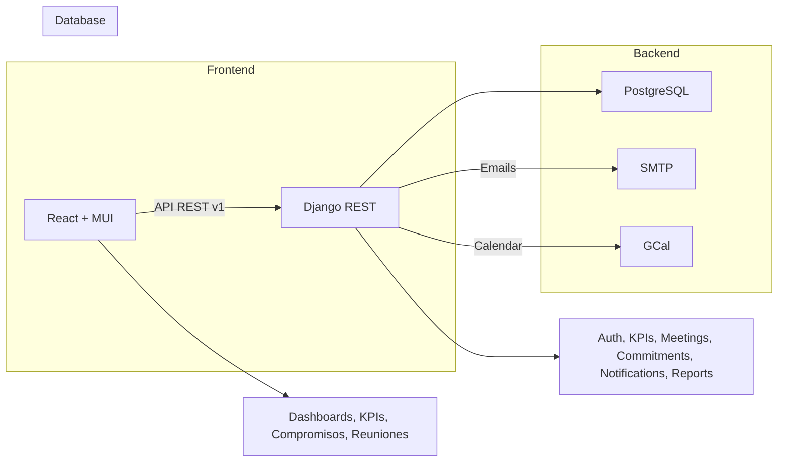

# Plataforma de Gestión de Diálogos de Desempeño (DdD) - Nutrisco

Este documento maestro unificado consolida la estructura, el alcance y las especificaciones técnicas para la Plataforma de Gestión de Diálogos de Desempeño (DdD) de Nutrisco. Está diseñado como el *single source of truth* para el Product Owner, la gerencia y el equipo de desarrollo, cubriendo desde la visión de negocio hasta los contratos de la API y el plan de despliegue.

## 1. Visión General y Resumen Ejecutivo

La Plataforma DdD de Nutrisco es una herramienta digital de gestión por excepción, enfocada en digitalizar y agilizar la toma de decisiones. Su objetivo principal es exponer y priorizar los KPIs que están fuera de norma (alerta) para facilitar la acción inmediata a través de la generación de Compromisos (acciones).

### Exportar a Hojas de cálculo

## 2. Imagen Conceptual y Arquitectura de Alto Nivel

La plataforma utiliza una arquitectura moderna y modular para garantizar escalabilidad, seguridad y una experiencia de usuario fluida.

### 2.1. Arquitectura & Stack Técnico

| Capa | Tecnología Principal | Propósito |
|------|---------------------|-----------|
| Frontend (FE) | React 18 + TypeScript (Vite) + MUI | Interfaz de usuario, flujos de KPI, Dashboards. Migración planificada a TypeScript. |
| Backend (BE) | Django 5 + Python 3.11 + DRF | Lógica de negocio, APIs RESTful, seguridad (RBAC). |
| Base de Datos (DB) | PostgreSQL 15 | Persistencia de datos, histórico de KPIs y auditoría. |
| Servicios | JWT, Docker, Nginx, Celery | Autenticación segura, Contenerización, Despliegue, Tareas asíncronas (Importación, Notificaciones). |

### Exportar a Hojas de cálculo

### 2.2. Diagrama Conceptual (Mermaid Flowchart)



### 2.3. Estructura de Repositorio (Key Folders)

El repositorio principal nutrisco-ddd/ se organizará con una clara separación de responsabilidades:

```
orizont-ddd/
├── frontend/
│   ├── src/ (components, pages, services, hooks, types)
├── backend/
│   ├── apps/ (users, kpis, meetings, commitments, notifications, reports)
│   ├── ddd/ (settings, config)
├── docker/
├── docs/
└── scripts/
```

## 3. Modelo de Datos Esenciales (Core Models)

Definición de los modelos Django ORM que sustentan el sistema.

| Modelo | Descripción y Campos Clave | Consideraciones |
|--------|---------------------------|-----------------|
| Area | Entidad de negocio. name, manager (FK a CustomUser), is_active. | Permite segmentar KPIs y Reuniones. |
| CustomUser | Extensión de AbstractUser. area (FK), role (Estratégico, Táctico, Operativo). | Define permisos y acceso a Dashboards. |
| KPI | Métrica de desempeño. name, area (FK), meta, umbral_amarillo, umbral_rojo, direction (CRÍTICO: higher_is_better \| lower_is_better). | |
| KPIValue | Registro histórico del valor. kpi (FK), date, value, shift, source. | Permite auditoría y cálculo de tendencias. |
| MeetingType | Plantilla de reunión. name (DdD Estratégico/Táctico/Operativo), schedule_time, frequency. | Configura la automatización de reuniones. |
| Meeting | Instancia de una reunión DdD. meeting_type (FK), date, participants (M2M), area (FK), status, notes, google_calendar_event_id. | Unidad de tiempo y contexto para los Compromisos. |
| Commitment | Acción derivada. meeting (FK), kpi (FK, opc.), description, proposed_action, responsible (FK), due_date, status (pending, in_progress, completed, overdue), attachments. | Captura la acción y permite trazabilidad. |
| KPIAlert (Sugerido) | Modelo auxiliar. kpi (FK), date, level (AMARILLO \| ROJO), is_active. | |

### Exportar a Hojas de cálculo

## 4. Funcionalidades Core y Reglas de Negocio

### 4.1. Gestión por Excepción (Motor de KPIs)

El motor evalúa KPIValue contra KPI para determinar el estado: OK (Verde), AMARILLO, ROJO.

**Lógica de Umbrales:** Depende del campo direction en el modelo KPI.

- Ejemplo higher_is_better: value < umbral_rojo → ROJO.
- Ejemplo lower_is_better: value > umbral_rojo → ROJO.

**Alertas:** Las desviaciones (AMARILLO/ROJO) disparan:

1. Listado prioritario en el Dashboard de Gestión por Excepción.
2. Notificaciones por email/push al responsable del área.
3. Pre-carga de la información de la desviación en el formulario de Creación Rápida de Compromiso.

### 4.2. Sistema DdD (Flujo Central)

- **Creación:** Las reuniones DdD se crean automáticamente (cron basado en MeetingType) o manualmente.
- **Integración:** Opción de sincronizar con Google Calendar (google_calendar_event_id) para notificar a los participantes.
- **Interfaz de Reunión:** El UI del DdD presenta un snapshot de los KPIs en alerta en ese momento y permite la creación expedita de Compromisos.

### 4.3. Flujo de Compromisos (Lifecycle)

- **Creación Rápida:** Al crear un Compromiso desde un KPI en alerta, el sistema pre-carga kpi, area, y description (con plantilla).
- **Notificación:** Notificación inmediata (email + in-app) al responsible asignado.
- **Vencimiento (Overdue):** El estado cambia automáticamente a overdue si due_date pasa y el estado no es completed.
- **Auditoría de Cierre:** El cambio de estado a completed requiere una evidencia (adjunto) y un comentario de cierre obligatorio.

### 4.4. Autenticación y Autorización (Seguridad)

- **Auth:** JWT (Access + Refresh Token). Preparado para futura integración OAuth2/SSO.
- **RBAC (Role-Based Access Control):** Los roles (Estratégico, Táctico, Operativo) controlan el acceso a endpoints sensibles (ej. solo Administrador puede hacer CRUD de KPI).
- **Auditoría:** Todas las acciones críticas (CRUD de KPI, cambios de estado de Compromiso) deben registrarse en logs de auditoría.

## 5. Interfaces y Dashboards

Los Dashboards se diseñan bajo el principio de Gestión por Excepción, priorizando la acción sobre la simple visualización.

| Dashboard | Rol / Audiencia | Foco Principal |
|-----------|-----------------|----------------|
| Strategic Dashboard | Gerencia, Estratégico | Vista consolidada de Riesgo (KPIs críticos de todas las áreas) y resumen de Compromisos pendientes/vencidos. |
| Tactical Dashboard | Jefes de Área, Táctico | Tablero de Compromisos de su área (Kanban simple por estado) y KPIs desviados de su área. |
| Operative Dashboard | Supervisores, Operativo | Métricas por Turno/Línea y creación expedita de Compromisos Operativos. |

### Exportar a Hojas de cálculo

### Componente Clave: KPICard

El componente KPICard es el motor visual de la excepción. Muestra el KPI, su último valor y color de estado (🔴/🟡/🟢). Incluye la llamada a la acción (CTA) principal: Crear Compromiso (que abre el CommitmentForm precargado).

## 6. Integración, Pruebas y Despliegue (Parte 2 en Detalle)

Esta sección consolida los planes de trabajo para la implementación y la calidad.

### 6.1. Integración con Excel

- **Importación:** Se debe soportar la carga masiva de KPIValue y la creación/actualización de KPI a través de plantillas Excel/CSV estandarizadas.
- **Procesamiento Asíncrono:** La importación se procesa en background (Celery) debido a que puede ser una tarea de larga duración.
- **Reporting de Errores:** Tras la importación, el usuario recibe un import_log detallando filas procesadas, creadas, actualizadas y las que fallaron (con el motivo, ej. "Área inexistente" o "Valor no numérico").

### 6.2. Estrategia de Pruebas (QA)

- **Unit Tests:** Cobertura de la lógica de negocio más sensible (cálculo de umbrales, upsert de KPIValues, flujo de notificaciones).
- **E2E (End-to-End):** Uso de Cypress/Playwright para validar los flujos críticos: Login → Dashboard → Crear Compromiso → Subir Evidencia → Cerrar Compromiso.
- **Entorno:** Un entorno de staging reproducible (Docker) es obligatorio para la validación de QA antes del deploy a producción.

### 6.3. Despliegue y CI/CD (DevOps)

- **Pipeline:** Implementación de CI/CD (ej. GitHub Actions) que automatice: Tests → Build → Deploy Staging → E2E Smoke → Deploy Producción (Aprobación Manual).
- **Infraestructura:** Contenedores de Docker para BE, FE, Worker (Celery), y DB (Postgres).
- **Observability:** Logs centralizados, métricas básicas (latencia, error rate) y gestión segura de secretos de producción.

### 6.4. Cronograma (Sprint Compacto)

Se estima un cronograma inicial de 3-4 sprints (5 días hábiles) para alcanzar un MVP desplegable en producción:

- **Sprint 0 (Setup):** Repositorio, Docker, CI básico, Modelos Core (User, Area).
- **Sprint 1 (Base):** Autenticación JWT, CRUD de KPI, Inserción de KPIValue, Dashboard inicial (solo KPIs).
- **Sprint 2 (Core DdD):** Modelos Meeting y Commitment, Flujo Crear Compromiso desde KPI, Notificaciones básicas, Admin KPI Table.
- **Sprint 3 (QA & Go-Live):** Importación Excel, E2E Tests, Despliegue Staging y Producción, refinamiento de Dashboards.